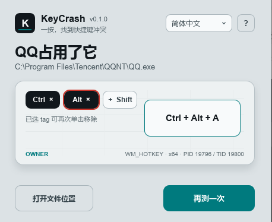

# KeyCrash

**Find out why your shortcut isn't working.**

[简体中文](README.md) · English · [日本語](README.ja.md)

KeyCrash checks for global hotkey registration conflicts and tries to identify the app using it.

For **Windows 10 / 11 (64-bit)**. No installation needed. Available in Chinese, English, and Japanese.

## Download and run

Open a successful run under **Actions → Windows build** in this repository. Download `keycrash-v<version>-windows-x64` from **Artifacts**. GitHub may ask you to sign in.

Extract the entire archive and run `keycrash.exe`. Keep the other files and the `owner-x86` folder alongside it.

## How to use

1. Select **Ctrl / Alt / Shift** as needed. Click again to deselect, or leave all three off.
2. Click **Start detection**, then press only the target key inside KeyCrash. To check `Ctrl + Shift + K`, select Ctrl and Shift, then press K.
3. Read the result. If a registration conflict is found, choose **Locate**. When an app is found, you can open its file location.

Press **Esc** to cancel waiting for a key. Use the top-right language menu or **?** for help.

## Please note

A normal check does not trigger the full shortcut. **Locating an app may trigger the shortcut's original action** and may request administrator permission. No registration conflict does not rule out keyboard hooks or other listeners. F12 is shown as system-reserved. Temporary registrations by other apps count as conflicts while they remain active.
